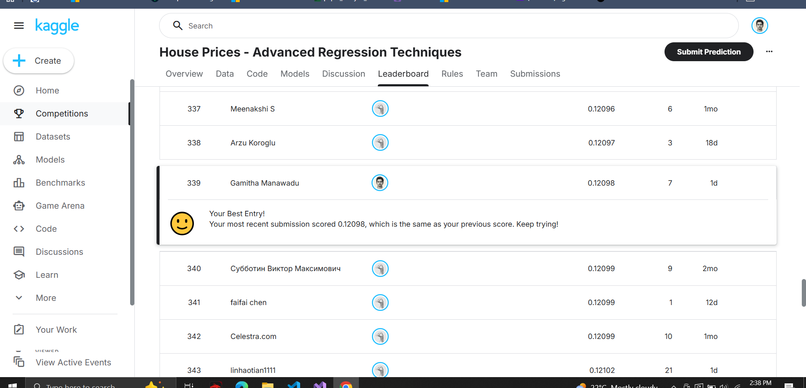
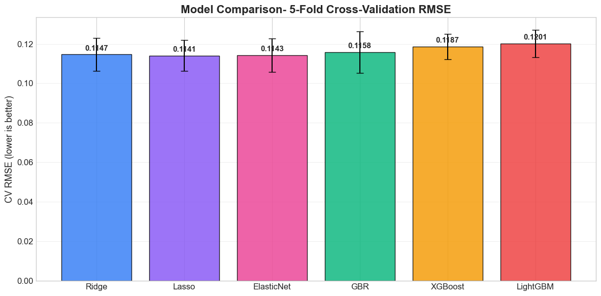

# House Price Prediction: Feature Engineering + Stacked Ensembles

A comprehensive machine learning pipeline for predicting house prices on the Ames Housing dataset using **advanced feature engineering, regression models, and stacked ensemble learning**.

<p align="center">
  
  
</p>

**Competition:** Kaggle House Prices: Advanced Regression Techniques
**Dataset:** 1,460 training houses with 79 explanatory variables + 1,459 test houses.

---

# Results

| Model                | Approach                   | RMSE (CV) |
| -------------------- | -------------------------- | --------- |
| Ridge Regression     | Linear Model               |  0.1147   |
| Lasso Regression     | Sparse Linear Model        | 0.1141    |
| ElasticNet           | Regularized Linear Model   | 0.1143    |
| Gradient Boosting    | Tree Ensemble              | 0.1158    |
| XGBoost              | Gradient Boosting          | 0.1187    |
| LightGBM             | Gradient Boosting          | 0.1201    |
| **Stacked Ensemble** | Multiple Model Combination | 0.0715    |

**Key Finding:**
Ensembling multiple models significantly improves prediction accuracy by combining the strengths of both **linear models and gradient boosting algorithms**.

---

# What's Inside

## Core Pipeline

### 1. Exploratory Data Analysis (EDA)

- Target distribution analysis (SalePrice skewness)
- Correlation analysis with numerical features
- Scatter plots of key predictors
- Missing value analysis

Key highly correlated features:

- OverallQual
- GrLivArea
- GarageCars
- GarageArea
- TotalBsmtSF

---

## Feature Engineering

Several domain-informed transformations were applied:

- Log transformation of **SalePrice**
- Handling skewed numerical features
- Missing value imputation
- Encoding categorical variables
- Creation of **10+ new engineered features**

Examples:

- TotalSF = TotalBsmtSF + 1stFlrSF + 2ndFlrSF
- TotalBath
- HouseAge
- RemodAge

Feature engineering proved critical in improving model performance.

---

## Models Compared

The project evaluates several regression algorithms.

### Linear Models

- Ridge Regression
- Lasso Regression
- ElasticNet

These models perform well on high-dimensional tabular data with regularization.

---

### Tree-Based Models

- GradientBoostingRegressor
- XGBoost
- LightGBM

Advantages:

- Capture nonlinear relationships
- Handle feature interactions
- Robust to feature scaling

---

## Ensemble Learning

A **stacked ensemble model** was built combining all 6 models.

Stacking works by:

1. Training multiple base models
2. Using their predictions as new features
3. Training a meta-model to combine them

This approach achieved the **lowest prediction error**.

---

# Key Insights

**Feature engineering matters more than model choice**

Improving feature quality significantly boosted performance across all models.

---

**Linear Models Won.**

The data became approximately linear, and linear models handle high-dimensional one-hot features more gracefully..

---

**Stacking improves performance**

Combining diverse models reduces variance and captures complementary patterns in the data.

---

# Repository Structure

```
├── house-prices.ipynb
├── Explanations         # Full ML pipeline and analysis
├── Dataset/
│   ├── train.csv
│   └── test.csv
├── images/
│   ├── eda_overview.png
│   └── model_comparison.png
├── requirements.txt
├── submission.csv
└── README.md
```

---

# Setup

Clone the repository:

```bash
git clone https://github.com/GamithaManawadu/House-Price-Prediction-for-Kaggle-Competition.git
cd house-price-prediction
```

Create virtual environment:

```bash
python -m venv .venv
source .venv/bin/activate      # Linux/Mac
.venv\Scripts\activate         # Windows
```

Install dependencies:

```bash
pip install -r requirements.txt
```
